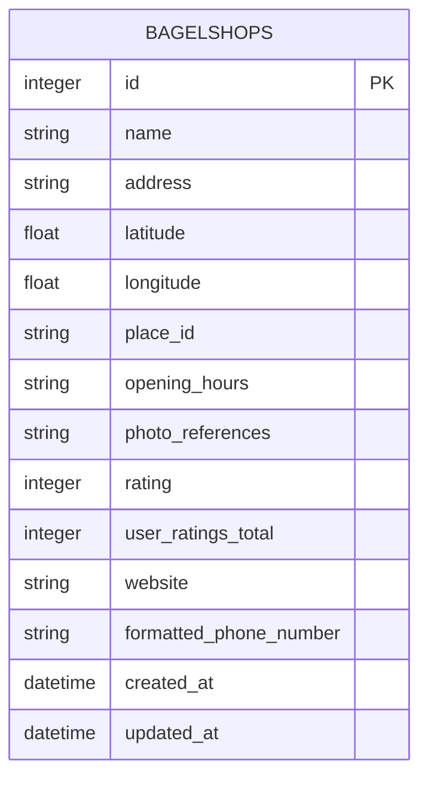

# BagelMap（ベーグルマップ）

## 🔍 サービス概要

**BagelMap** は、ベーグル専門店を地図上で簡単に検索できるWebアプリです。現在地や指定したエリア周辺のベーグル専門店を地図上ですぐに確認でき、ベーグル好きの方が「行ってみたい！」と思えるお店を探すお手伝いをします。

---

## 💡 サービスを作った背景

ベーグルにハマった母と一緒に専門店を探していたとき、「普通の地図アプリでは見つけづらい」「情報が少ない」と感じたのがきっかけです。

Googleマップでは検索がうまくヒットしないことも多く、ベーカリーやカフェが混ざってしまうことも……。「それならベーグル専門店だけに絞った検索ができるアプリを作ろう！」と思い立ち、開発に至りました。

---

## 👤 想定ユーザー

- ベーグルが好きな人
- ベーグル専門店をめぐってみたい人
- 健康志向の人や卵・乳製品を控えたい人（ベーグルは卵・バター・ミルク不使用が多め）

---

## 🚀 実装機能

- GoogleMapsによる地図表示
- 現在地取得 & 周辺の店舗表示
- キーワード検索機能（店名・住所）
- GoogleMapの評価やレビュー数による絞り込み
- 検索結果一覧と地図上のピン表示
- 営業中／閉店中アイコンの色分け
- 店舗の基本情報表示（評価、住所、営業時間など）

---

## 📸 実際の画面と機能紹介

| 現在地取得・周辺店舗の表示 |
| :---: |
|  |
| 
「現在地を取得」ボタンをクリックすると、現在位置を中心に地図が表示されます。地図にはベーグル専門店が表示されていて、現在地周辺の店舗を検索できます。
 |
 

| キーワード検索と地図上での詳細遷移 | |
| :---: | :---: |
| 地図からアクセス | 一覧からアクセス |
|  |  |
| 
店名や住所で検索を行うと、地図上に該当店舗が表示され、ピンをクリックすることで詳細ページにアクセスできます。
 | 
検索結果は地図とともにリストとしても表示され、そこから店舗の詳細ページにアクセスすることも可能です。
 |
 

| 絞り込み検索（評価・レビュー数） |
| :---: |
|  |
| 
Googleの評価・レビュー数で店舗を絞り込むことができ、高評価のお店を見つけやすくします。
 |
 

| ソート機能（評価・レビュー数） |
| :---: |
|  |
| 
評価やレビュー数順で並び替えができ、条件に合うお店を見つけやすくなります。
 |
 

| 地図のリセット・現在地の再取得 | |
| :---: | :---: |
|  |  |
| 
リセットボタンで地図と検索結果を初期状態に戻すことができます。
 | 
現在地取得ボタンで再度現在地を取得することができます。
 |
 

| 営業状況によるピンの色分け |
| :---: |
|  |
| 
営業中の店舗は茶色、閉店中はグレーで表示され、直感的に開いているお店がわかるよう工夫しています。
 |
 

| GoogleMaps連携 | |
| ルート検索 | GoogleMapsの店舗情報にアクセス |
| :---: | :---: |
|  |  |
| 
各店舗ページにはGoogleMapsのルート検索へのリンクがあり、ナビとして活用できます。
 | 
各店舗ページにはGoogleMapsの店舗情報へのリンクがあり、店舗情報を取得できます。
 |

---

## 🖥 技術スタック

| 分類 | 技術 |
|------|------|
| フロントエンド | HTML / CSS / JavaScript |
| バックエンド | Ruby / Ruby on Rails |
| インフラ | Fly.io |
| 外部API | Google Maps Platform（Places API / Maps API） |

---

## 🗺 地図・位置情報のこだわりポイント

- Google Maps API を用いたピンの表示
- 営業時間を自動判定して色分け（営業中：茶色／営業時間外：グレー）
- ピンをクリックで画像＋詳細情報を表示

---

## 📌 ER図

---

## 🗒 補足：プロジェクト開始当初のREADME

プロジェクトの構想段階で作成した初期READMEも、開発の背景や思考過程を知る参考として以下に掲載しています。

➡ [Start_README.md を読む](./Start_README.md)
